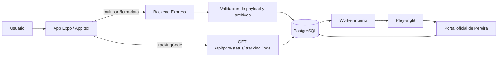

# Arquitectura del proyecto

## Componentes

- `App.tsx`: interfaz principal de la app movil.
- `backend/src/server.js`: API HTTP, validacion de arranque, worker y estados.
- `backend/src/validation.js`: validacion y saneamiento de los datos de entrada.
- `backend/src/pereiraAutomation.js`: automatizacion del portal externo con Playwright.
- `backend/src/db.js`: conexion a PostgreSQL.
- `backend/scripts/local-setup.cjs`: bootstrap local con Docker, base de datos y `.env`.

## Flujo de datos

## Lectura del flujo

1. La app resuelve la URL del backend desde las variables `EXPO_PUBLIC_*`.
2. El usuario llena la solicitud, adjunta archivos y envia el formulario.
3. El backend valida campos, limite de archivos, tipos permitidos y persistencia inicial.
4. La solicitud queda en estado pendiente mientras el worker procesa la radicacion oficial.
5. La app consulta el estado por `trackingCode` hasta recibir consecutivo, radicado o error.

## Configuracion

Frontend:

- `pq-ia-app/.env.example`

Backend:

- `pq-ia-app/backend/.env.example`

## Superficie historica

Los archivos raiz `index-pereira.html`, `pereira-index.js` y `pereira-define.js` describen una superficie anterior del portal de Pereira. No forman parte del flujo activo de la app Expo, pero sirven como contexto tecnico para entender la automatizacion y las referencias antiguas del sitio.