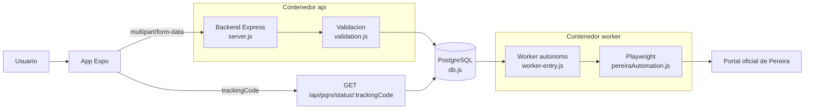

# Arquitectura del proyecto

## Componentes

- `App.tsx`: entrada principal de la app movil — delega UI en componentes modulares.
- `src/components/`: 6 componentes de paso (`AppNotice`, `StepEvidence`, `StepLocation`, `StepMessage`, `StepReview`, `StepStatus`).
- `src/styles.ts`: estilos globales y tema.
- `backend/src/server.js`: API HTTP, validacion de arranque.
- `backend/src/worker-entry.js`: entry point separado del worker de automatizacion.
- `backend/src/worker.js`: logica del worker (cola, reintentos, radicacion).
- `backend/src/validation.js`: validacion y saneamiento de los datos de entrada (Zod).
- `backend/src/pereiraAutomation.js`: automatizacion del portal externo con Playwright.
- `backend/src/db.js`: conexion a PostgreSQL (pool).
- `backend/src/routes/health.js`: healthcheck de API, base de datos y Playwright.
- `backend/scripts/local-setup.cjs`: bootstrap local con Docker, base de datos y `.env`.
- `docker-compose.yml`: despliegue con contenedores separados para `api` y `worker`.

## Flujo de datos



## Lectura del flujo

1. La app resuelve la URL del backend desde las variables `EXPO_PUBLIC_*`.
2. El usuario llena la solicitud (multi-paso en `src/components/`), adjunta archivos y envia el formulario.
3. El backend valida campos, limite de archivos, tipos permitidos y persiste la solicitud en PostgreSQL.
4. El worker autonomo (`worker-entry.js`) sondea la tabla `automation_jobs` y procesa las solicitudes pendientes.
5. La app consulta el estado por `trackingCode` hasta recibir consecutivo, radicado o error.

## Despliegue con Docker

```bash
docker compose up -d
```

Levanta tres servicios independientes:
- **postgres**: base de datos PostgreSQL 16.
- **api**: backend Express (`Dockerfile.api`) — solo sirve HTTP y valida.
- **worker**: worker de automatizacion (`Dockerfile.worker`) — solo ejecuta Playwright.

## Configuracion

Frontend:

- `.env.example` (raiz del proyecto)

Backend:

- `backend/.env.example`

## Superficie historica

Los archivos raiz `index-pereira.html`, `pereira-index.js` y `pereira-define.js` describen una superficie anterior del portal de Pereira. No forman parte del flujo activo de la app Expo, pero sirven como contexto tecnico para entender la automatizacion y las referencias antiguas del sitio.