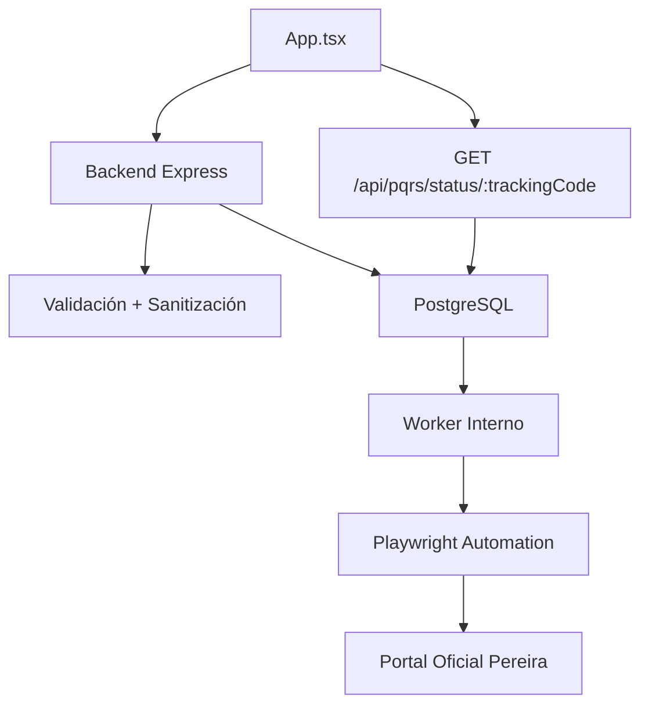

# Diagrama de Clases / Estructura de Código

## Arquitectura general

Este proyecto sigue un patrón de separación de responsabilidades:

- **Frontend (Expo/React Native)**: `App.tsx` - interfaz móvil de 5 pasos
- **Backend (Node/Express)**: Múltiples módulos especializados
- **Automatización**: Worker con Playwright para portal externo
- **Base de datos**: PostgreSQL para persistencia



## Tipos principales (Frontend)

### LocationPoint
```typescript
interface LocationPoint {
  latitude: number;
  longitude: number;
}
```

### PersonalData
```typescript
interface PersonalData {
  fullName: string;
  idNumber: string;
  email: string;
  phone: string;
}
```

### TrackingSnapshot
```typescript
interface TrackingSnapshot {
  trackingCode: string;
  status: string;
  consecutivoOficial?: string | null;
  radicadoOficial?: string | null;
  portalMessage?: string | null;
  lastErrorCode?: string | null;
  lastErrorMessage?: string | null;
  createdAt?: string;
  updatedAt?: string;
  events: TrackingEvent[];
}
```

### TrackingEvent
```typescript
interface TrackingEvent {
  to_status: string;
  reason: string | null;
  detail: string | null;
  created_at: string;
}
```

## Módulos del Backend

### server.js
- Punto de entrada HTTP
- Bootstrap de base de datos
- Worker de automatización
- Manejo de errores
- Configuración centralizada

### worker.js
- Worker de fondo para automatización
- Cola de trabajos `pqrs-radicacion`
- Playwright automation
- Manejo de fallos y reintentos

### pereiraAutomation.js
- Controlador de Playwright para portal externo
- Selección de elementos dinámicos
- Extracción de consecutivo/radicado
- Manejo de archivos adjuntos

### validation.js
- Esquemas Zod para payload
- Sanitización XSS
- Validación de archivos (extensiones, tamaño, MIME)
- Transformaciones de valores

### db.js
- Pool de conexiones PostgreSQL
- Función `query()` helper
- Asegura conexión en arranque

### config.js
- Variables de entorno centralizadas
- Valores por defecto para desarrollo/producción
- Validación de variables obligatorias

### constants.js
- `ALLOWED_EXTENSIONS` - Set de extensiones permitidas
- `ALLOWED_MIME_TYPES` - Set de MIME types permitidos
- `MAX_FILES` - Máximo de archivos (10)
- `MAX_FILE_SIZE_BYTES` - Tamaño máximo (27MB)
- `MEDIO_RESPUESTA_LABEL` - Etiquetas de medios de respuesta
- `TIPO_SOLICITUD_LABEL` - Etiquetas de tipos de solicitud

## Tablas de Base de Datos

```sql
-- requests
id (PK), medio_respuesta, correo, tipo_solicitud, asunto, descripcion_formal, status, attempts, consecutivo_oficial, radicado_oficial, portal_message, last_error_code, last_error_message, created_at, updated_at

-- request_status_events
id (PK), request_id (FK), from_status, to_status, reason, detail, created_at

-- request_attachments
id (PK), request_id (FK), storage_path, original_name, created_at

-- automation_jobs
id (PK), request_id (FK), job_state, retry_count, created_at, updated_at
```

## Flujos de control

### Flujo de automatización del worker
1. `claimNextPendingJob()` - Selecciona trabajo pendiente
2. `loadRequestJobData()` - Carga payload y archivos
3. `markRequestProcessing()` - Marca como en proceso
4. `submitAnonymousPQRS()` - Ejecuta Playwright
5. `markRequestSuccessful()` - Guarda resultado
6. `markRequestFailed()` - Maneja fallos
7. `cleanupRequestFiles()` - Elimina archivos temporales

### Flujo de validación
1. `validateBody()` - Zod schema validation + sanitización
2. `validateFiles()` - Validación de extensiones, MIME, tamaño
3. `buildTrackingCode()` - Genera código de seguimiento
4. `mapToHumanValues()` - Agrega etiquetas legibles

## Dependencias principales

### Frontend (package.json)
- `@expo/config-plugins` - Plugins nativos
- `react-native-maps`, `expo-location` - Geolocalización
- `react-native-webview` - WebView para Android

### Backend (backend/package.json)
- `zod` - Validación de esquemas
- `playwright` - Automatización web
- `pg` - Cliente PostgreSQL
- `dotenv` - Variables de entorno

## Notas de diseño

1. **Single Page App (SPA)**: Frontend como aplicación móvil de 5 pasos con wizard
2. **Arquitectura de dos superficies**: `App.tsx` (captura) + `backend/` (procesamiento)
3. **Automatización asíncrona**: Worker en segundo plano para portal externo
4. **Polling con backoff**: Seguimiento de estado con exponential backoff y jitter
5. **Sanitización XSS**: Eliminación de scripts y patrones peligrosos en inputs
6. **Seguridad**: CORS configurado, rate limiting implícito, validación estricta

## Diagrama de relaciones (Conceptual)

```
Usuario → App.tsx (Wizard 5 pasos) → Backend (API) → PostgreSQL
                                        ↓
                                    Worker → Playwright → Portal Pereira
                                        ↓
                                    App.tsx (Polling) ← GET /status/:trackingCode
```
