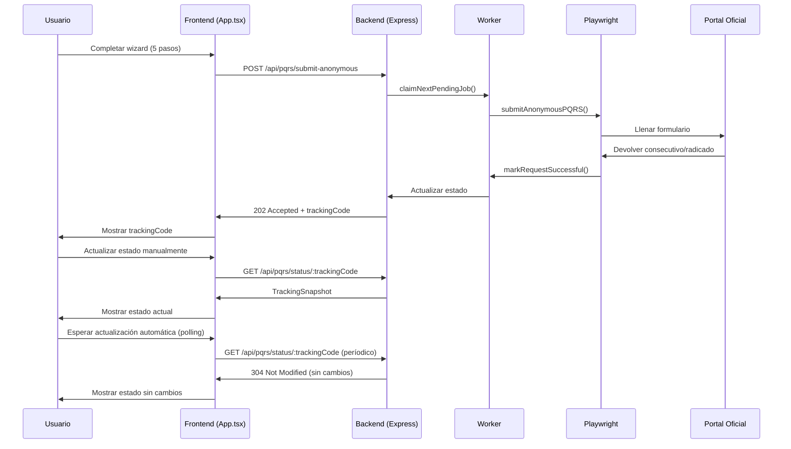

# Diagrama de Flujo de Usuario (User Journey)

## Descripción general

Pereira Te Escucha es una aplicación móvil de Expo/React Native que guía a los ciudadanos a través de un **wizard de 5 pasos** para radicar PQRSD (Peticiones, Quejas, Reclamos, Sugerencias y Denuncias) ante la Alcaldía de Pereira de forma **anónima y simple**.

## Flujo principal del usuario

```mermaid
graph TD
    %% Inicio
    U[Usuario] --> S1[App inicia]
    
    %% Paso 1: Ubicación
    S1 --> P1[Paso 1: Seleccionar ubicación]
    P1 --> L1[Usar ubicación actual]
    P1 --> L2[Tocar en mapa]
    L1 --> L2
    L2 --> P2[Confirmar ubicación]
    
    %% Paso 2: Tipo + Mensaje
    P2 --> P3[Paso 2: Tipo de solicitud y mensaje]
    P3 --> T1[Seleccionar PQRD: Petición, Queja, Reclamo, Sugerencia, Denuncia]
    P3 --> T2[Seleccionar medio de respuesta]
    T1 --> T2
    T2 --> M1[Escribir mensaje informal]
    M1 --> P4[Reescribir formal]
    
    %% Paso 3: Evidencias + Datos
    P4 --> P5[Paso 3: Adjuntar evidencias y datos personales]
    P5 --> A1[Agregar fotos (≤10, ≤27MB cada una)]`
    P5 --> D1[Completar datos personales (opcional)]
    A1 --> D1
    D1 --> P6[Validar y continuar]
    
    %% Paso 4: Envío
    P6 --> P7[Paso 4: Enviando solicitud]
    P7 --> S1[Animación de progreso (4 etapas)]
    S1 --> P8[Mostrar estado]
    
    %% Paso 5: Seguimiento
    P8 --> T3[Mostrar trackingCode]
    T3 --> F1[Actualizar estado manualmente]
    T3 --> F2[Esperar actualización automática]
    F1 --> T4[Consultar GET /api/pqrs/status/:trackingCode]
    F2 --> T4
    T4 --> R1[Mostrar radicado/consecutivo oficial]
    R1 --> B1[Finalizar]
    
    %% Bucle de seguimiento
    B1 --> F2
    
    %% Reiniciar
    R1 --> N1[Nuevo caso]
    N1 --> P1
```

## Detalle paso a paso

### Paso 1: Seleccionar ubicación
**Objetivo:** Identificar geográficamente el lugar del caso

- **Acciones:**
  - Usar GPS actual (si está disponible)
  - Tocar en el mapa para seleccionar punto exacto
  - Obtener dirección formateada desde reverse geocoding

- **Validación:** Punto seleccionado requerido

- **Datos capturados:** `LocationPoint {latitude, longitude}`, dirección legible

### Paso 2: Tipo de solicitud y mensaje ciudadano
**Objetivo:** Capturar el tipo de PQRSD y una descripción informal del problema

- **Acciones:**
  - Seleccionar tipo de solicitud (5 opciones en chips)
  - Elegir medio de respuesta (cartelera, correo electrónico, correo físico)
  - Escribir mensaje informal (mínimo 15 caracteres sugeridos)

- **Validación:**
  - Tipo de solicitud seleccionado
  - Mensaje con longitud mínima
  - Email requerido si medio es correo electrónico

- **Procesamiento:**
  - `formalizeContext()` - Reescritura en lenguaje institucional
  - Detección de intenciones (vial, residuos, inundación, alumbrado, general)

### Paso 3: Evidencias y datos personales
**Objetivo:** Agregar pruebas visuales y datos de contacto (opcionales para anonimato)

- **Acciones:**
  - Agregar hasta 10 fotos (≤27MB cada una)
  - Completar datos personales (opcional para anonimato)
  - Validar formatos y tamaños de archivos

- **Validación:**
  - Límite de archivos (10)
  - Tamaño máximo (27MB)
  - Extensiones permitidas (JPG, PNG, PDF, DOC, etc.)
  - Formato de email (si se proporciona)

### Paso 4: Envío y reescritura formal
**Objetivo:** Transformar mensaje informal a carta formal institucional

- **Acciones:**
  - Presionar "Redactar carta" para procesar con NLP
  - Revisar y editar carta formal generada
  - Iniciar envío a backend

- **Proceso de envío:**
  1. Healthcheck del backend
  2. Validación de payload (Zod + sanitización)
  3. Generación de `trackingCode`
  4. Envío de `multipart/form-data`
  5. Animación de progreso (4 etapas)

### Paso 5: Seguimiento del estado
**Objetivo:** Monitorear el progreso del radicado y obtener confirmación oficial

- **Acciones:**
  - Mostrar `trackingCode` para referencia
  - Opción de actualización manual
  - Polling automático (5s → 60s con backoff)
  - Mostrar radicado/consecutivo oficial cuando disponible

- **Estados:**
  - `recibido` - Recibido, esperando procesamiento
  - `en_proceso` - En cola para automatización
  - `radicado` - Radicado oficialmente
  - `error_temporal` - Error temporal, reintentar
  - `fallo` - Fallo definitivo

## Flujo técnico detallado

### Flujo de datos

```
Usuario → App.tsx (Frontend React Native)
                    ↓
   (multipart/form-data) → Backend Express (Node.js)
                    ↓
   Validación (Zod) + Sanitización → PostgreSQL
                    ↓
   Worker (Playwright) → Portal Oficial Pereira
                    ↓
   Consulta GET /api/pqrs/status/:trackingCode ← App.tsx (Polling)
```

### Timeline de estados

| Evento | Acción | Responsable |
|--------|--------|-------------|
| Inicio app | Cargar pantalla de bienvenida | Frontend |
| Completar paso | Guardar estado local | Frontend |
| Enviar solicitud | POST /api/pqrs/submit-anonymous | Backend |
| Recibir trackingCode | Mostrar código y comenzar polling | Frontend |
| Worker toma caso | claimNextPendingJob() | Worker |
| Radicar en portal | Playwright automation | Worker |
| Guardar resultado | markRequestSuccessful() | Worker |
| Consultar estado | GET /api/pqrs/status/:trackingCode | Frontend |
| Mostrar radicado | Mostrar consecutivo y radicado | Frontend |

## Estados de error y recuperación

### Errores en tiempo de envío
- **Network error**: Mostrar mensaje, permitir reintentar
- **Timeout**: Usar backoff exponencial, máximo 40 intentos
- **429/503**: Respete `Retry-After` header
- **Payload inválido**: Mostrar errores de validación

### Errores en tiempo de seguimiento
- **304 Not Modified**: No hay cambios, continuar polling
- **429/503**: Pausar polling, mensaje informativo
- **Error de red**: Reintentar con backoff, máximo 5 errores consecutivos
- **Limite de intentos**: Mostrar mensaje, opción de actualización manual

## Accesibilidad y usabilidad

### Indicadores de progreso
- Barra de progreso visual (porcentaje)
- Etapas activas/pendientes con animaciones
- Tiempos de etapa mostrados (opcional)

### Retroalimentación al usuario
- Notificaciones toast para acciones exitosas
- Mensajes de error claros con sugerencias
- Estados de carga durante envíos
- Indicador de polling activo

### Navegación
- Wizard de 5 pasos con retroceso/salto
- Formulario validado en tiempo real
- Botones de acción claros (Siguiente/Enviar)
- Opción para reiniciar desde cualquier estado

## Flujo técnico de backend

### API Endpoints

#### POST /api/pqrs/submit-anonymous
**Descripción:** Enviar solicitud anónima
**Content-Type:** `multipart/form-data`

| Campo | Requerido | Descripción |
|-------|-----------|-------------|
| `medioRespuesta` | Sí | `cartelera`, `correo_electronico`, `correo_fisico` |
| `correo` | Condicional | Requerido si `medioRespuesta=correo_electronico` |
| `tipoSolicitud` | Sí | `peticion`, `queja`, `reclamo`, `sugerencia`, `denuncia` |
| `asunto` | Sí | Asunto de la solicitud (máx 255 chars) |
| `descripcion` | Sí | Descripción formal (mín 1 char) |
| `aceptarTratamiento` | Sí | Debe ser `true` |
| `files` | No | Array de archivos (0..10) |

**Respuesta (202 Accepted):**
```json
{
  "ok": true,
  "code": "ACCEPTED",
  "data": {
    "trackingCode": "PETE-20260407195500-4821",
    "status": "recibido",
    "statusUrl": "/api/pqrs/status/PETE-20260407195500-4821"
  }
}
```

#### GET /api/pqrs/status/:trackingCode
**Descripción:** Consultar estado de radicación
**Respuesta:**
- `200 OK` con snapshot actual
- `304 Not Modified` si no hay cambios
- `404 Not Found` si trackingCode no existe

### Flujo de automatización del worker

```mermaid
graph TD
    A[Worker Loop] --> B[claimNextPendingJob()]
    B --> C{¿Hay trabajo?}
    C -->|No| A
    C -->|Sí| D[loadRequestJobData()]
    D --> E[markRequestProcessing()]
    E --> F[submitAnonymousPQRS()]
    F --> G{¿Éxito?}
    G -->|Sí| H[markRequestSuccessful()]
    G -->|No| I[markRequestFailed()]
    H --> J[cleanupRequestFiles()]
    I --> J
    J --> A
```

## Diagrama de secuencias (User Journey)



## Métricas y análisis

### Eventos de seguimiento
- `trackingCode` generado para cada solicitud
- Eventos de estado: `recibido` → `en_proceso` → `radicado`
- Tiempos de procesamiento medidos (etapa por etapa)
- Tasa de éxito de automatización

### KPIs de usuario
- Tasa de abandono por paso
- Tiempo promedio por radicación completa
- Cantidad de casos por día/semana
- Satisfacción de seguimiento (si se implementa)

## Documentación relacionada

- [ARCHITECTURE.md](docs/ARCHITECTURE.md) - Arquitectura técnica detallada
- [AUDIT.md](docs/AUDIT.md) - Hallazgos de deuda técnica
- [CLASS_DIAGRAM.md](docs/CLASS_DIAGRAM.md) - Diagrama de clases y módulos
- [PRIVACY_POLICY.md](docs/PRIVACY_POLICY.md) - Política de privacidad
- [ROADMAP_PLAY_STORE.md](docs/ROADMAP_PLAY_STORE.md) - Pendientes para publicación

## Notas de implementación

### Consideraciones de diseño

1. **Flujo asíncrono:** Los usuarios pueden continuar usando la app mientras el worker radica en segundo plano
2. **Polling inteligente:** Backoff exponencial con jitter para evitar colisiones
3. **Reintentos:** Límite de 40 intentos, luego mensaje de pausa manual
4. **Anonimato:** Posibilidad de enviar sin datos personales
5. **Offline:** La app funciona sin conexión, sincroniza cuando hay internet

### Flujos edge case

- **Cambios de red:** Pausar polling, reanudar cuando se restablezca conexión
- **Errores del portal:** Worker marca como fallido, app muestra error
- **Límite de archivos:** Mensaje claro cuando se alcanza límite
- **Timeout de envío:** Mostrar error con sugerencia de verificar backend
- **Cambio de orientación:** UI responsive para todos los dispositivos

### Consideraciones de internacionalización

- Interfaz en español (idioma principal)
- Posibilidad de cambiar a inglés (si se implementa)
- Formatos de fecha/hora según locale
- Direcciones geográficas en español
